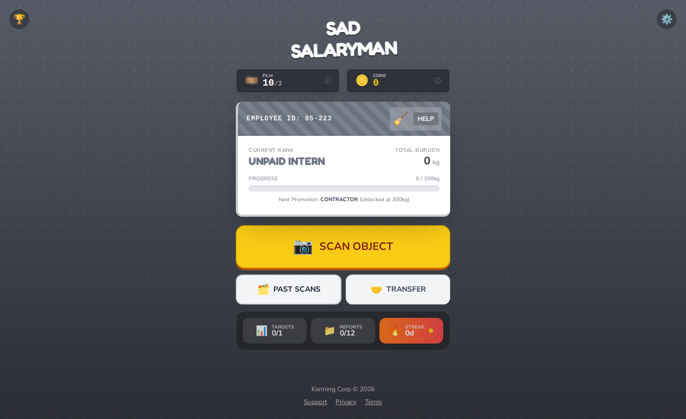
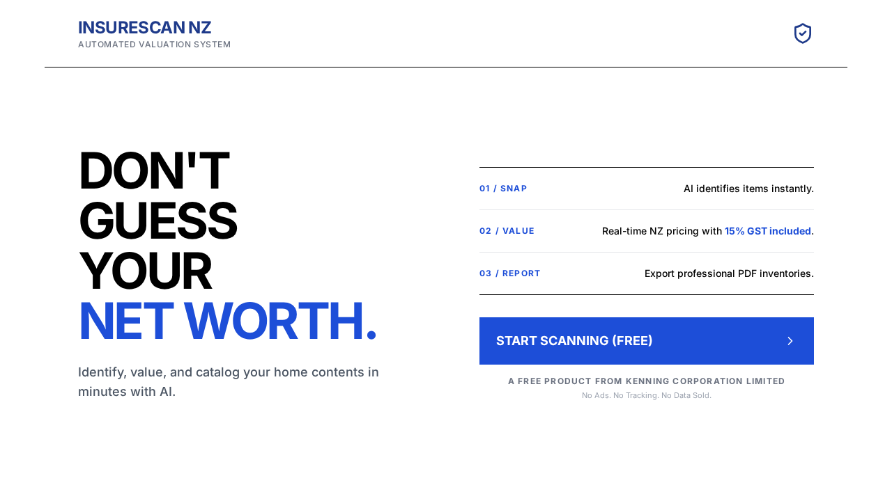
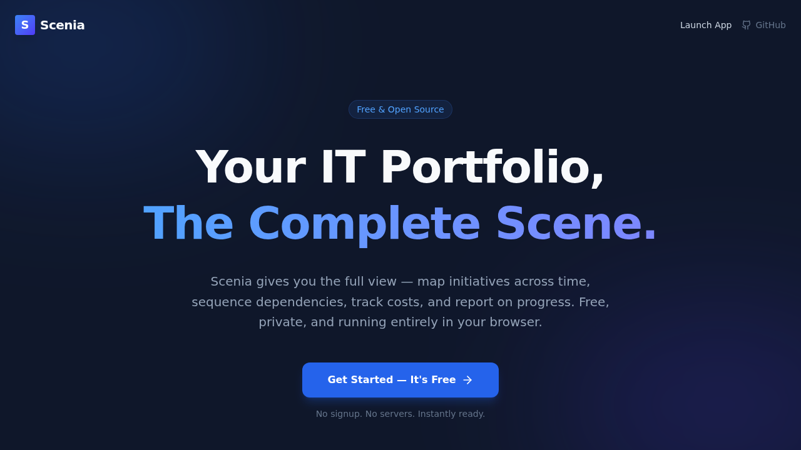
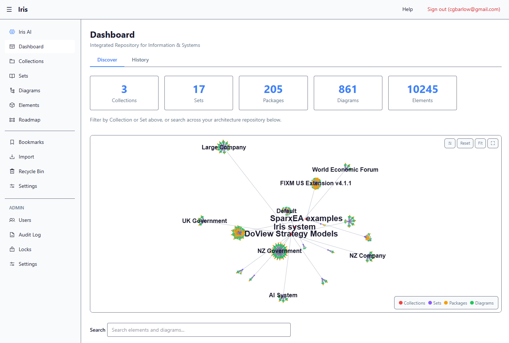
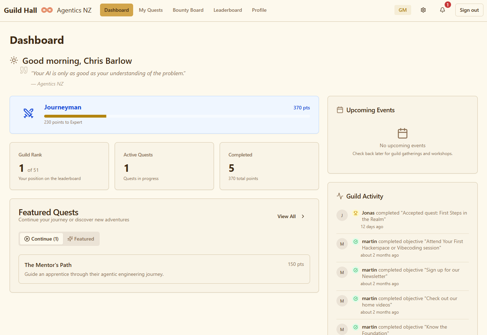
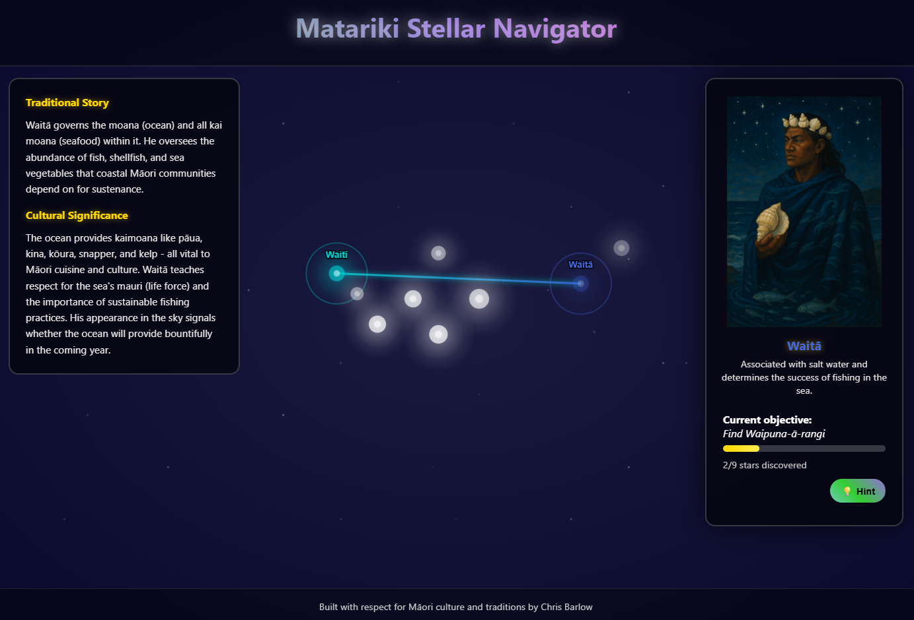
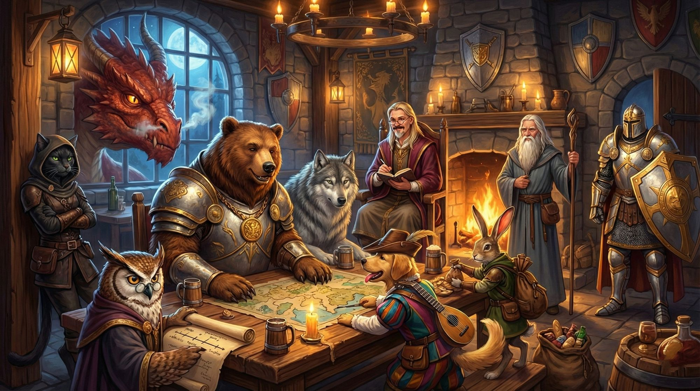

# Agentics NZ Showcase

A curated collection of projects built by the Agentics NZ community using AI agents.

---

## Categories

- [Built with AI Agents](#built-with-ai-agents) — Applications, tools, and projects created using AI agents
- [Tools for AI Agent Development](#tools-for-ai-agent-development) — Primitives, libraries, and infrastructure that help build AI agents

---

## Built with AI Agents

Projects in this section are full applications, products, and prototypes built *using* AI agents as part of the development workflow.

---

### Sad Salaryman



A gamified object scanning app where you earn "burden" as an unpaid intern.

**Description:** Turn your life into a corporate simulation. Scan everyday objects to earn burden, track your progress through corporate ranks, and climb from Unpaid Intern to Contractor.

**Stack:** TBD

**Builder:** [Waylon Kenning](https://kenning.co.nz)

**Links:**
- 🌐 Live: [sadsalaryman.com](https://sadsalaryman.com)

---

### InsureScan NZ



AI-powered home contents valuation for insurance.

**Description:** Identify, value, and catalog your home contents in minutes with AI. Snap photos of items, get instant NZ pricing with GST included, and export professional PDF inventories for insurance claims.

**Stack:** TBD

**Builder:** [Waylon Kenning](https://kenning.co.nz)

**Links:**
- 🌐 Live: [insurescan.website](https://insurescan.website)

---

### Scenia



IT Portfolio Planning & Visualisation.

**Description:** Map initiatives across time, sequence dependencies, track costs, and report on progress. A visual timeline tool for IT portfolio planning with conflict detection, critical path analysis, and budget visualisation.

**Stack:** React, TypeScript, Vite, Tailwind, IndexedDB (Dexie)

**Builder:** [Waylon Kenning](https://kenning.co.nz)

**Links:**
- 🌐 Live: [scenia.website](https://scenia.website)
- 🐙 GitHub: [waylonkenning/scenia](https://github.com/waylonkenning/scenia)

---

### Iris



Integrated Repository for Information & Systems — a web-based architectural modeling tool.

**Description:** Create, manage, and version architectural entities, relationships, and diagrams in a repository-first system where entities are the source of truth and diagrams are projections. Supports Simple View, UML, ArchiMate, and sequence diagrams with an interactive knowledge graph, collections and sets, audit logging, and full keyboard accessibility (WCAG 2.2 AA).

**Stack:** SvelteKit, Svelte 5, @xyflow/svelte, Tailwind CSS v4, FastAPI, SQLite / Supabase (PostgreSQL), Argon2id + JWT auth

**Builder:** [Chris Barlow](https://github.com/cgbarlow)

**Links:**
- 🐙 GitHub: [cgbarlow/iris](https://github.com/cgbarlow/iris)

---

### Guild Hall



A quest-based engagement platform that reframes community participation around adventure rather than obligation.

**Description:** Game Masters design quests with objectives, deadlines, and difficulty levels. Community members accept quests from a Bounty Board, submit evidence to complete objectives, and earn points and skill tier progression. Built on the philosophy that "obstacles are expected" on quests, whereas goals frame struggle as failure.

**Stack:** Next.js 15, React 18, TypeScript, Tailwind CSS, shadcn/ui, Supabase, TanStack Query, React Hook Form, Zod, Vitest, Netlify

**Builder:** [Chris Barlow](https://github.com/cgbarlow)

**Links:**
- 🌐 Live: [guildhall.agentics.org.nz](https://guildhall.agentics.org.nz)
- 🐙 GitHub: [cgbarlow/guild-hall](https://github.com/cgbarlow/guild-hall)

---

### Matariki Stellar Navigator



An interactive web experience celebrating Matariki, the Māori New Year.

**Description:** Explore the nine stars of the Matariki cluster through an interactive navigator that pairs traditional stories and cultural significance with a guided star-finding experience. Built with respect for Māori culture and traditions.

**Stack:** JavaScript, HTML, CSS, Netlify

**Builder:** [Chris Barlow](https://github.com/cgbarlow)

**Links:**
- 🌐 Live: [matarikinav.netlify.app](https://matarikinav.netlify.app)
- 🐙 GitHub: [cgbarlow/matariki](https://github.com/cgbarlow/matariki)

---

## Tools for AI Agent Development

Projects in this section are libraries, frameworks, and tooling that help *build* AI coding agents — not the agents themselves, but the infrastructure around them.

---

### Campaign Mode



Assemble a party of AI advisors with genuinely different perspectives.

**Description:** A plugin system for Claude Desktop and Claude Code CLI that frames collaborative problem-solving as a quest. Six animal-based agents provide distinct viewpoints while three NPC characters (Gandalf, Guardian, Dragon) offer mentorship, progress evaluation, and adversarial testing — helping surface blind spots and stress-test ideas before they matter. Built on the Six Animals framework with Markdown-based persistence for campaign state.

**Stack:** Claude Desktop / Claude Code plugin, Markdown persistence (`.campaign/quest.md`), CC-BY-SA-4.0

**Builder:** [Chris Barlow](https://github.com/cgbarlow)

**Links:**
- 🐙 GitHub: [cgbarlow/campaign-mode](https://github.com/cgbarlow/campaign-mode)

---

### Machine Dream

A continuous AI cognition platform that lets models learn from experience and consolidate knowledge across sessions.

**Description:** Uses Sudoku as a research testbed to implement a learning loop where AI plays puzzles, makes mistakes, "dreams" (consolidates experiences into patterns), and improves over time — with no external hints or deterministic fallbacks. Implements the GRASP Loop (Generate → Review → Absorb → Synthesize → Persist) with three clustering algorithms: FastCluster, DeepCluster, and LLMCluster.

**Stack:** TypeScript, Node.js 20+, SQLite, OpenAI-compatible APIs (LM Studio, OpenAI, Anthropic, Ollama, OpenRouter)

**Builder:** [Chris Barlow](https://github.com/cgbarlow)

**Links:**
- 🐙 GitHub: [cgbarlow/machine-dream_AG](https://github.com/cgbarlow/machine-dream_AG)

---

### ADR (WH(Y) Method)

An enhanced Architecture Decision Record format for AI-assisted development teams.

**Description:** Addresses structural inconsistency and the conflation of decision rationale with implementation details in existing ADR practice. Provides standardised templates, dependency tracking between decisions, and governance metadata so humans and AI agents can capture and maintain architectural choices with clarity. Language-agnostic and designed to integrate with ADR tooling via options like `adr new --mode=enhanced`.

**Stack:** Markdown specification, language-agnostic templates

**Builder:** [Chris Barlow](https://github.com/cgbarlow)

**Links:**
- 🐙 GitHub: [cgbarlow/adr](https://github.com/cgbarlow/adr)

---

## Adding Your Project

To add a project to the showcase:

1. Fork this repository
2. Add your entry to the appropriate section using the format below
3. Submit a pull request

### Entry Format

```markdown
### Your Project Name


One-paragraph description of what it does.

**Description:** A longer description if needed.

**Stack:** Tech stack (e.g. React, Python, Claude API)

**Builder:** Your name or company

**Links:**
- 🌐 Live: https://...
- 🐙 GitHub: https://github.com/...
```

### Screenshot Guidelines

- Max dimensions: 1200px wide
- Format: PNG or JPG
- File name: `{project-name}.png` in the `/screenshots` folder
- Add the image reference right after your project title